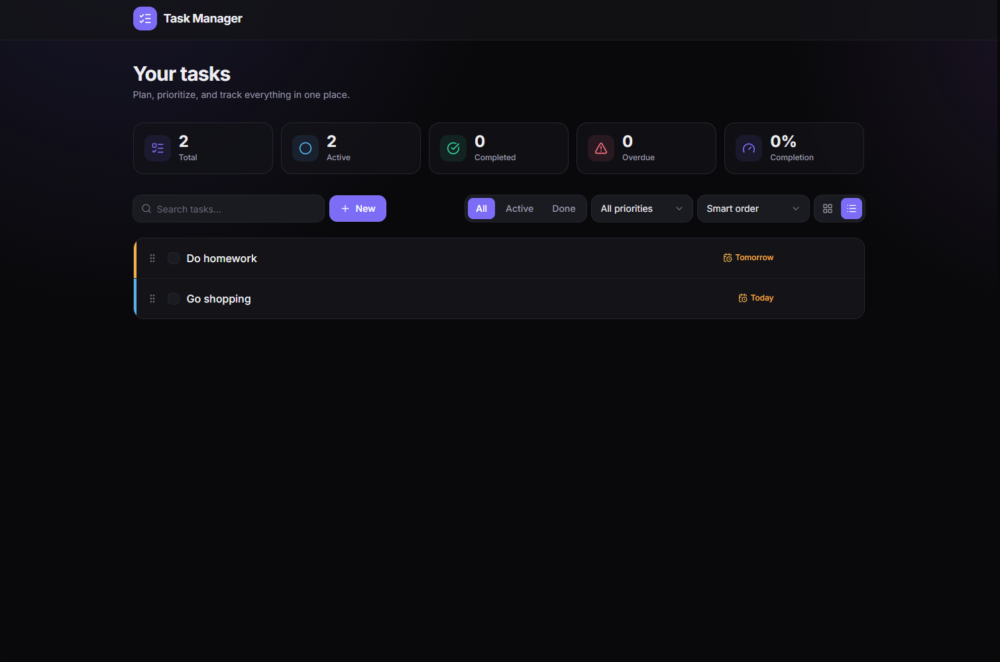

<div align='center'>

[![demo][demo]][demo-link]
[![status][status]][status-link]
[![test][tests]][tests-link]
[![ci][ci]][ci-link]

</div>

<div align='center'>
  <a href='/'>
    
  </a>
</div>

<div align='center'>
  <h1>Task Manager with Django and React</h1>
</div>

<div align='center'>

[![Python][python]][python-link]
[![Django][django]][django-link]
[![Django REST Framework][django-rest-framework]][django-rest-framework-link]
[![React][react]][react-link]
[![Vite][vite]][vite-link]
[![Tailwind CSS][tailwindcss]][tailwindcss-link]
[![Framer Motion][framer-motion]][framer-motion-link]
[![Axios][axios]][axios-link]
[![React Hook Form][react-hook-form]][react-hook-form-link]
[![React Hot Toast][react-hot-toast]][react-hot-toast-link]
[![Pytest][pytest]][pytest-link]
[![Vitest][vitest]][vitest-link]
[![GitHub Actions][github-actions]][github-actions-link]

</div>

<div align='center'>
  Modern full-stack task manager built with Django REST Framework and React. Dark Linear-style UI with animations, priorities and due dates, live search and filters, drag-and-drop ordering, a stats dashboard — backed by test suites with 95% coverage gates and a CI pipeline.

[Demo](https://django-crud-react.onrender.com/) · [Report issue](/issues) · [Suggest something](/issues)

</div>

## Table of Contents

- [Table of Contents](#table-of-contents)
- [Features](#features)
- [Tech Stack](#tech-stack)
- [Getting Started](#getting-started)
  - [Prerequisites](#prerequisites)
  - [Installation](#installation)
  - [Running locally](#running-locally)
  - [Build](#build)
- [Environment Variables](#environment-variables)
- [Project Structure](#project-structure)
- [Demo](#demo)
- [API Reference](#api-reference)
- [Contributing](#contributing)
- [License](#license)

## Features

- [x] Full CRUD for tasks with optimistic updates and rollback on failure
- [x] Task priorities (low/medium/high) and due dates with overdue highlighting
- [x] Drag-and-drop manual ordering in list view (plus keyboard-friendly arrows), persisted server-side
- [x] Live debounced search plus status and priority filters (server-side)
- [x] Sorting by smart order, manual order, dates, priority, or title
- [x] Stats dashboard: totals, active, completed, overdue, and completion rate
- [x] Grid and list views with the choice persisted across sessions
- [x] Dark Linear-style UI with motion animations (staggered cards, sliding controls, animated counters)
- [x] Custom accessible UI kit: dropdown select, calendar date picker, modal with focus trap
- [x] Server-side pagination with load-more
- [x] Auto-generated API documentation with drf-spectacular (OpenAPI 3 / Swagger UI)
- [x] Backend test suite (pytest, 99% coverage) and frontend suite (Vitest + Testing Library, 218 tests) with enforced 95% coverage gates
- [x] CI pipeline with GitHub Actions: lint, tests, coverage reports, and production build
- [x] Static files served with WhiteNoise; database flexibility via dj-database-url (SQLite or PostgreSQL)

## Tech Stack

- [Python](https://www.python.org/)
- [Django 5.2](https://www.djangoproject.com/)
- [Django REST Framework](https://www.django-rest-framework.org/)
- [django-filter](https://django-filter.readthedocs.io/en/stable/)
- [drf-spectacular](https://drf-spectacular.readthedocs.io/en/latest/)
- [React 19](https://react.dev/)
- [Vite](https://vite.dev/)
- [Tailwind CSS 4](https://tailwindcss.com/)
- [Motion (Framer Motion)](https://motion.dev/)
- [Axios](https://axios.rest/)
- [React Hook Form](https://react-hook-form.com/)
- [React Hot Toast](https://react-hot-toast.com/)
- [React Router](https://reactrouter.com/)
- [Lucide](https://lucide.dev/)
- [pytest](https://docs.pytest.org/en/stable/)
- [Vitest](https://vitest.dev/)
- [Testing Library](https://testing-library.com/)
- [GitHub Actions](https://github.com/features/actions)
- [WhiteNoise](https://whitenoise.readthedocs.io/en/latest/)
- [Gunicorn](https://gunicorn.org/)

## Getting Started

### Prerequisites

- Python 3.10+
- Node.js 20.19+ (22 LTS recommended)
- npm
- pip

### Installation

Clone the repository:

```bash
git clone https://github.com/wrujel/django-crud-react.git
cd django-crud-react
```

Create and activate a virtual environment (keeps the backend dependencies isolated):

```bash
python -m venv .venv

# macOS / Linux
source .venv/bin/activate

# Windows (PowerShell)
.\.venv\Scripts\Activate.ps1

# Windows (cmd)
.venv\Scripts\activate.bat
```

Install the backend and frontend dependencies:

```bash
pip install -r requirements.txt
cd client
npm install
cd ..
```

### Running locally

Start the backend server (make sure the virtual environment is activated):

```bash
python manage.py migrate
python manage.py runserver
```

In a separate terminal, start the frontend dev server:

```bash
cd client
npm run dev
```

Open [http://localhost:5173](http://localhost:5173) with your browser to see the React app. The Django API runs at [http://localhost:8000](http://localhost:8000).

### Build

Build the frontend for production:

```bash
cd client
npm run build
```

Other useful commands (both test suites enforce a **95% coverage gate** and are run by CI on every push and pull request):

| Command                               | Where    | Action                                       |
| :------------------------------------ | :------- | :------------------------------------------- |
| `pip install -r requirements-dev.txt` | root     | Install backend test dependencies            |
| `pytest`                              | root     | Backend tests + coverage gate (`htmlcov/`)   |
| `npm test`                            | `client` | Frontend tests (single run)                  |
| `npm run test:watch`                  | `client` | Frontend tests in watch mode                 |
| `npm run test:coverage`               | `client` | Frontend tests + coverage gate (`coverage/`) |
| `npm run lint`                        | `client` | ESLint over the frontend source and tests    |

## Environment Variables

To run this project, you may need to configure the following environment variables:

| Variable           | Description                                               | Required |
| :----------------- | :-------------------------------------------------------- | :------: |
| `DATABASE_URL`     | Database connection URL (defaults to SQLite if not set)   |    No    |
| `VITE_BACKEND_URL` | Backend API URL used by the React app in production       |    No    |
| `SECRET_KEY`       | Django secret key (insecure dev fallback if unset)        |   Prod   |
| `DEBUG`            | Debug mode; set to `False` in production (default `True`) |    No    |
| `ALLOWED_HOSTS`    | Comma-separated allowed hosts (default `*`)               |   Prod   |

## Project Structure

```
/
├── client/                  # React frontend
│   ├── src/
│   │   ├── api/             # API endpoints (generic resource factory)
│   │   ├── components/      # Feature components
│   │   │   └── ui/          # Reusable UI kit (Select, DatePicker, Modal, ...)
│   │   ├── constants/       # Priority/sort/filter options
│   │   ├── hooks/           # useCollection, useLocalStorage, ...
│   │   ├── lib/             # http client, formatting, class-name utils
│   │   ├── pages/           # Page components
│   │   ├── test/            # Vitest setup (jsdom stubs)
│   │   ├── App.jsx
│   │   └── main.jsx
│   ├── package.json
│   └── vite.config.js       # Vite + Vitest (coverage thresholds)
├── django_crud_api/         # Django project settings
│   ├── settings.py
│   ├── urls.py
│   └── wsgi.py
├── tasks/                   # Django tasks app (+ its test modules)
│   ├── models.py
│   ├── serializer.py
│   ├── urls.py
│   └── views.py
├── tests/                   # Project-scope backend tests
├── .github/workflows/       # CI pipeline (backend + frontend jobs)
├── images/
│   └── screenshot.png
├── manage.py
├── pyproject.toml           # pytest + coverage config
├── requirements.txt
├── requirements-dev.txt
├── Procfile
└── nixpacks.toml
```

## Demo

You can check out the demo:

[![Demo][demo]][demo-link]

## API Reference

| Method   | Endpoint                       | Description                                 | Auth Required |
| :------- | :----------------------------- | :------------------------------------------ | :-----------: |
| `GET`    | `/tasks/api/v1/tasks/`         | List tasks (paginated, 24 per page)         |      No       |
| `POST`   | `/tasks/api/v1/tasks/`         | Create a new task                           |      No       |
| `GET`    | `/tasks/api/v1/tasks/:id/`     | Get task by ID                              |      No       |
| `PUT`    | `/tasks/api/v1/tasks/:id/`     | Update a task                               |      No       |
| `PATCH`  | `/tasks/api/v1/tasks/:id/`     | Partially update a task (e.g. completion)   |      No       |
| `DELETE` | `/tasks/api/v1/tasks/:id/`     | Delete a task                               |      No       |
| `POST`   | `/tasks/api/v1/tasks/reorder/` | Persist a manual order (`{"order": [ids]}`) |      No       |
| `GET`    | `/tasks/api/v1/tasks/stats/`   | Aggregate stats for the dashboard           |      No       |

List queries support `search`, `completed`, `priority`, `ordering` (e.g. `position`, `-created_at`, `due_date`, `-priority`, `title`), and `page` parameters.

Interactive API documentation (Swagger UI) is available at `/tasks/docs/`, powered by drf-spectacular. The raw OpenAPI 3 schema is served at `/tasks/schema/`.

## Contributing

Contributions are welcome! If you have suggestions or find bugs, please open an issue or submit a pull request.

1. Fork the repository
2. Create your feature branch (`git checkout -b feature/amazing-feature`)
3. Commit your changes (`git commit -m 'Add some amazing feature'`)
4. Push to the branch (`git push origin feature/amazing-feature`)
5. Open a Pull Request

## License

This project is licensed under the [MIT License](LICENSE).

---

<!-- Badges -->

[python]: https://img.shields.io/badge/Python-3776AB?style=for-the-badge&logo=python&logoColor=white
[django]: https://img.shields.io/badge/Django-092E20?style=for-the-badge&logo=django&logoColor=green
[django-rest-framework]: https://img.shields.io/badge/django%20rest-092E20?style=for-the-badge&logo=django&logoColor=green
[react]: https://img.shields.io/badge/React-20232A?style=for-the-badge&logo=react&logoColor=61DAFB
[vite]: https://img.shields.io/badge/Vite-646CFF?style=for-the-badge&logo=vite&logoColor=white
[tailwindcss]: https://img.shields.io/badge/Tailwind%20CSS-38B2AC?style=for-the-badge&logo=tailwind-css&logoColor=white
[framer-motion]: https://img.shields.io/badge/Framer%20Motion-2A2A2A?style=for-the-badge&logo=npm&logoColor=white
[axios]: https://img.shields.io/badge/Axios-671ddf?style=for-the-badge&logo=axios&logoColor=white
[react-hook-form]: https://img.shields.io/badge/React%20Hook%20Form-20232A?style=for-the-badge&logo=react&logoColor=61DAFB
[react-hot-toast]: https://img.shields.io/badge/React--Hot--Toast-2A2A2A?style=for-the-badge&logo=npm&logoColor=white
[pytest]: https://img.shields.io/badge/Pytest-0A9EDC?style=for-the-badge&logo=pytest&logoColor=white
[vitest]: https://img.shields.io/badge/Vitest-6E9F18?style=for-the-badge&logo=vitest&logoColor=white
[github-actions]: https://img.shields.io/badge/GitHub%20Actions-2088FF?style=for-the-badge&logo=github-actions&logoColor=white

<!-- Badge links -->

[python-link]: https://www.python.org/
[django-link]: https://www.djangoproject.com/
[django-rest-framework-link]: https://www.django-rest-framework.org/
[react-link]: https://react.dev/
[vite-link]: https://vite.dev/
[tailwindcss-link]: https://tailwindcss.com/
[framer-motion-link]: https://motion.dev/
[axios-link]: https://axios.rest/
[react-hook-form-link]: https://react-hook-form.com/
[react-hot-toast-link]: https://react-hot-toast.com/
[pytest-link]: https://docs.pytest.org/en/stable/
[vitest-link]: https://vitest.dev/
[github-actions-link]: https://github.com/features/actions

<!-- Status/Demo badges -->

[demo]: https://img.shields.io/badge/🚀%20Live%20Demo-000000?style=for-the-badge&&logoColor=white&color=0a6bdb
[demo-link]: https://django-crud-react.onrender.com/
[status]: https://img.shields.io/endpoint?url=https%3A%2F%2Fraw.githubusercontent.com%2Fwrujel%2Fmonitor-repos%2Fmain%2Fdata%2Fdjango-crud-react.json
[status-link]: https://github.com/wrujel/monitor-repos
[tests]: https://img.shields.io/endpoint?url=https%3A%2F%2Fraw.githubusercontent.com%2Fwrujel%2Fmonitor-tests%2Fmain%2Fdata%2Fdjango-crud-react.json
[tests-link]: https://github.com/wrujel/monitor-tests
[ci]: https://img.shields.io/github/actions/workflow/status/wrujel/django-crud-react/ci.yml?branch=master&style=for-the-badge&label=CI
[ci-link]: https://github.com/wrujel/django-crud-react/actions/workflows/ci.yml
